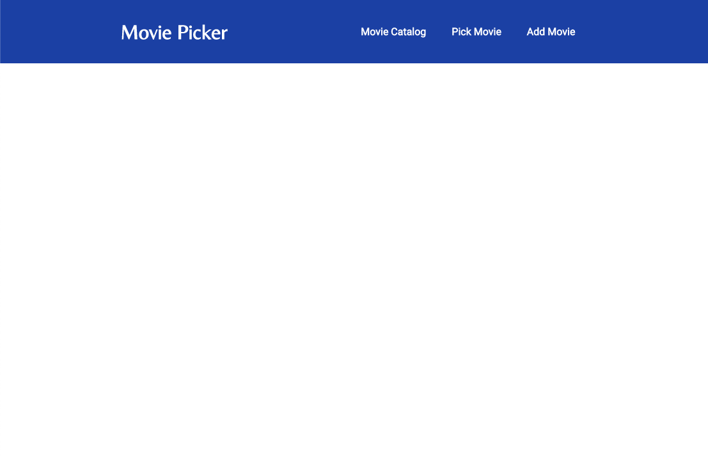
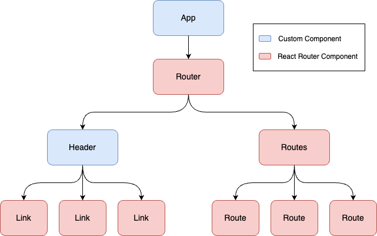
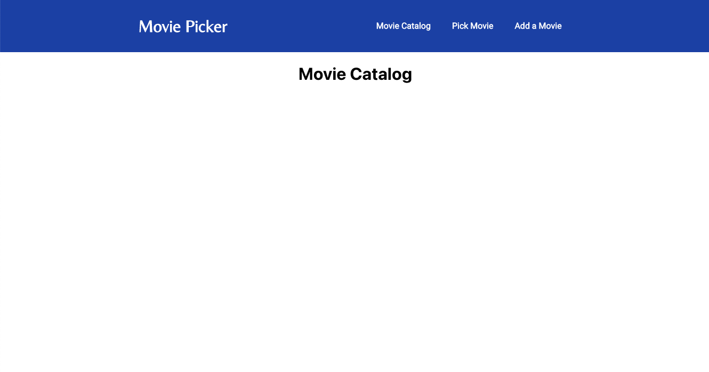
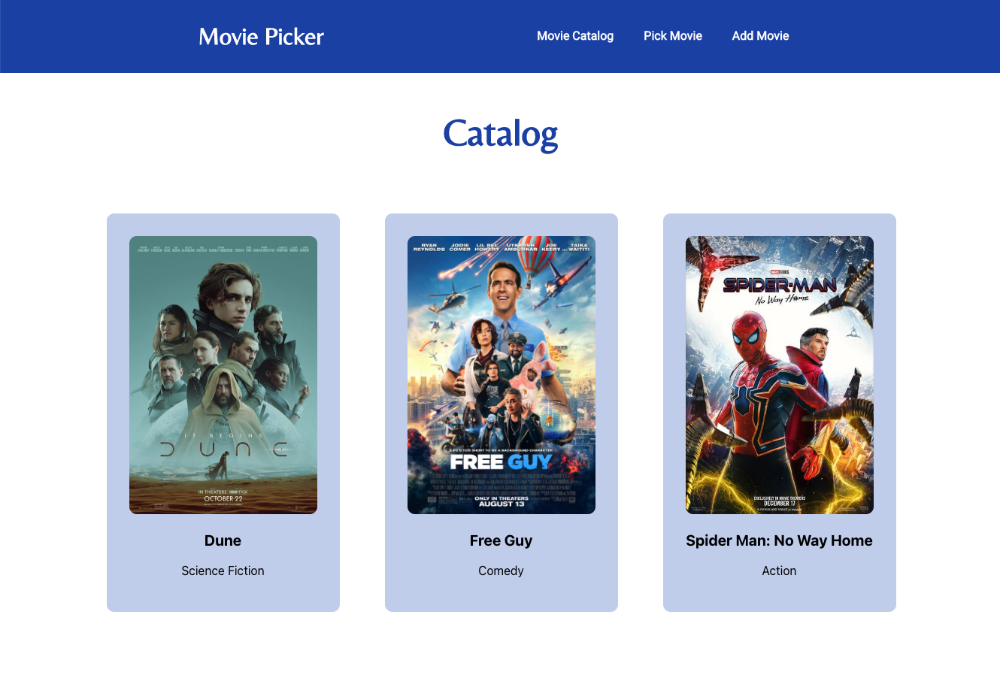
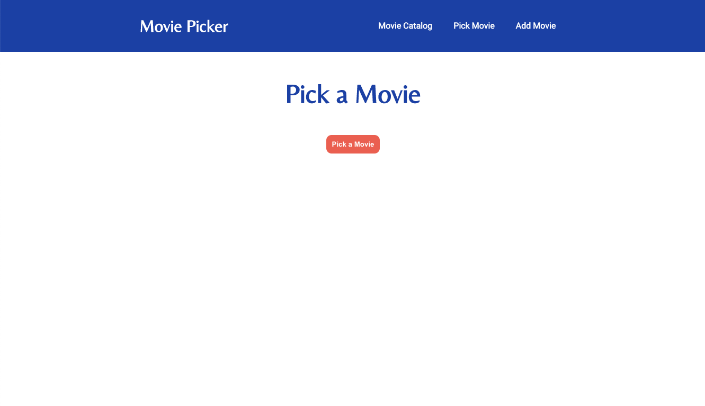
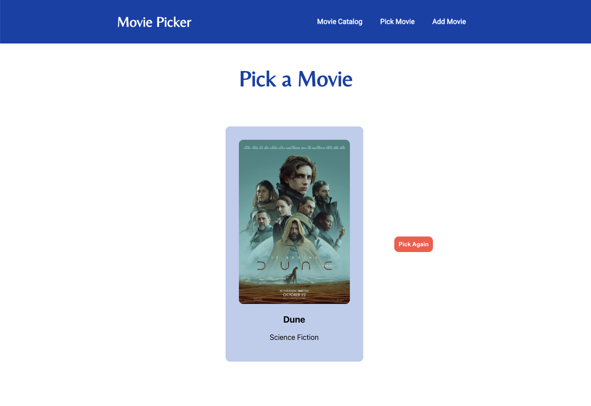
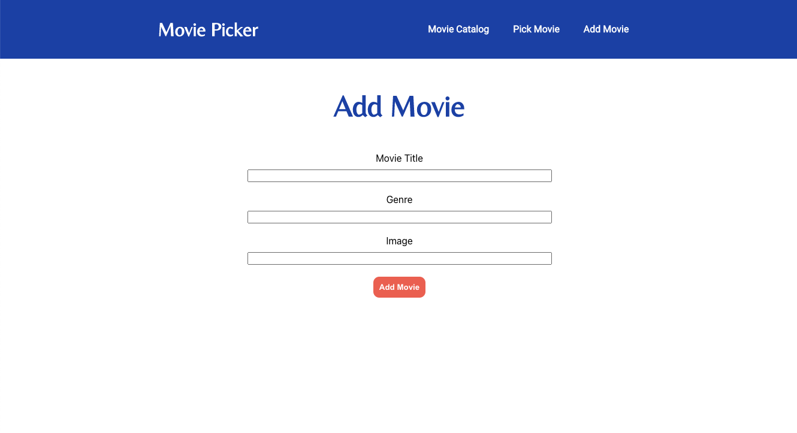

# Instructions

In this workshop we will be creating an interactive movie catalog in React.

- [Instructions](#instructions)
  - [Initial Setup](#initial-setup)
  - [Step 1: Creating a Header for our App](#step-1-creating-a-header-for-our-app)
  - [Step 2: Customizing the Header](#step-2-customizing-the-header)
  - [Step 3: Navigation](#step-3-navigation)
  - [Step 4: Showing the Catalog](#step-4-showing-the-catalog)
  - [Step 5: Picking a Random Movie](#step-5-picking-a-random-movie)
  - [Step 6: Adding a Movie](#step-6-adding-a-movie)

## Initial Setup

Ensure that Node version >= 14.0.0 and npm version>= 5.6 are installed on your machine. You can install node [here](https://nodejs.org/en/).

You can check your Node version by running the following command in your terminal:

```
node -v
```

You may also find the `ES7+ React/Redux/React-Native snippets` extension for VS Code helpful, but it is not required.

### Create a New React Project

To create a new React project, run the following commands in your terminal:

```
npx create-react-app my-app
cd my-app
npm start
```

This will provide the boilerplate code necessary to have a simple, running React application right out of the box. 

### Use Starter Code

Alternatively, you can also find the boilerplate code provided in [`starter-app`](./starter-app/) to begin creating your app! In order to run the `starter-app` application, clone or download this repo then run the following:

```
cd React-101
cd starter-app
npm install
npm start
```

View the running application at `http://localhost:3000`

---
## Step 1: Creating a Header for our App

We'll start in `src/App.js` by removing most of the boilerplate code for the App component, leaving only the outermost div for the return statement:

```jsx
// src/App.js
function App() {
  return (
    <div className="App">
      
    </div>
  );
}

export default App;
```

We can add the following HTML snippet inside the div:
```html
<h1>Hello World!</h1>
```

When we save the file, we will see the application running in our browser at `http://localhost:3000` has updated and now says "Hello World!"

Next, our website will need a proper header, which is the top section of a webpage containing quick access links to the main functions of the website, so let's create a `src/components` folder for the components we will be creating. Now we can create a `src/components/Header.js` file in our newly created folder which will contain our `Header` component:

```jsx
// src/components/Header.js
const Header = () => {
    return (
        <div>
            Header
        </div>
    );
}

export default Header;
```

We can use the `Header` component now by importing it into our `src/App.js` and adding it to our `App` component by replacing the div's content with our `Header` similar to how we use HTML elements:

```jsx
// src/App.js
import Header from './components/Header';

function App() {
  return (
    <div className="App">
      <Header/>
    </div>
  );
}
```

If we save `src/components/Header.js` and `src/App.js` we should see that our website now says "Header" instead of "Hello World!":


<details>
<summary>Completed files from this step</summary>
<br>

> ### Header.js
> ```jsx
> const Header = () => {
>     return (
>         <div>
>             Header
>         </div>
>     );
> }
> 
> export default Header;
> ```
> 
> ### App.js
> ```jsx
> import Header from './components/Header';
> 
> function App() {
>   return (
>     <div className="App">
>       <Header/>
>     </div>
>   );
> }
> 
> export default App;
> ```

</details>
<br>

## Step 2: Customizing the Header

Now let's start customizing our movie picker's header. For this step, we can create `src/App.css` and `src/components/Header.css` files to add CSS styling to our components. Feel free to use the completed CSS files [`movie-picker/src/App.css`](./movie-picker/src/App.css) and [`movie-picker/src/components/Header.css`](./movie-picker/src/components/Header.css):

```jsx
// src/App.js
import './App.css';
```

```jsx
// src/components/Header.js
import './Header.css';
```

These files for styling your webpage can also be found in the dropdown below:

<details>
<summary>Completed CSS files for <code>App</code> and <code>Header</code></summary>
<br>

> ### App.css
> ```css
> .App {
>   text-align: center;
> }
> 
> .title {
>   margin: 50px 0;
>   font-family: 'Belleza', sans-serif;
>   font-size: 50px;
>   color: #1D49AE;
> }
> 
> button {
>   background-color: #ED6A5A;
>   border: none;
>   padding: 10px;
>   border-radius: 10px;
>   font-weight: bold;
>   color: white
> }
> ```
> 
> ### Header.css
> ```css
> .header {
>   display: flex;
>   align-items: center;
>   justify-content: space-evenly;
>   height: 100px;
>   background-color: #1d49ae;
>   color: white;
> }
> 
> .logo {
>   font-family: 'Belleza', sans-serif;
> }
> 
> .links {
>   display: flex;
>   align-items: center;
>   justify-content: space-between;
>   font-family: 'Roboto', sans-serif;
> }
> 
> a {
>   margin: 0 20px;
>   text-decoration: none;
>   color: white;
>   font-weight: 600;
> }
> ```

</details>
<br>

We'll begin by having our `Header` show the name of the application and adding our `className` attributes for styling:

```jsx
// src/components/Header.js
const Header = () => {
    return (
        <div className="header">
            <h1 className="logo">Movie Picker</h1>
        </div>
    );
}
```

Most website headers will also contain links to popular pages or common functionalities. For our movie picker, we would like to have a home page where users can view the catalog of movies, a page for picking a random movie for the user, and a page where the user can upload their own movie entry to the catalog.

For our three pages, we will use the following URLs:
- `http://localhost:3000` will be our home page where users can browse the catalog of movies
- `http://localhost:3000/movie` will be the page where users can go to be given a movie suggestion at random
- `http://localhost:3000/add` will be the page where users can go to upload their own movie entry to the catalog

We can use anchor tags to link to specific routes. We will omit `http://localhost:3000` in our routes which gives us `/` for our home page, `/movie` for our movie suggestion page, and `/add` for our movie upload page:

```jsx
// src/components/Header.js
const Header = () => {
    return (
        <div className="header">
            <h1 className="logo">Movie Picker</h1>
            <div className="links">
                <a href="/">Movie Catalog</a>
                <a href="/movie">Pick Movie</a>
                <a href="/add">Add a Movie</a>
            </div>
        </div>
    );
}
```

If you click the header options, you'll notice the URL in your browser changes to reflect the route for each option you click and the page reloads. Now we have our header with buttons for our upcoming features:



<details>
<summary>Completed files from this step</summary>
<br>

> ### Header.js
> ```jsx
> import './Header.css';
> 
> const Header = () => {
>     return (
>         <div className="header">
>             <h1 className="logo">Movie Picker</h1>
>             <div className="links">
>                 <a href="/">Movie Catalog</a>
>                 <a href="/movie">Pick Movie</a>
>                 <a href="/add">Add a Movie</a>
>             </div>
>         </div>
>     );
> }
> 
> export default Header;
> ```
> 
> ### App.js
> ```jsx
> import Header from './components/Header';
> import './App.css';
> 
> function App() {
>   return (
>     <div className="App">
>       <Header/>
>     </div>
>   );
> }
> 
> export default App;
> ```

</details>
<br>

## Step 3: Navigation

As of right now, we don't have a simple and efficient way to display different pages to the user based on the option that's clicked. To enable this kind of navigation for the user, we will utilize a library called `react-router-dom` ([React Router](https://reactrouter.com/en/main)) which allows us to create "pages" for our app for users to navigate using buttons, links, or URLs. You will first need to stop the application by inputting `CTRL` + `c` into your terminal. 

Run the following commands to install the required library and restart the app:

```
npm i react-router-dom
npm start
```

Now we can import the `Link` component from `react-router-dom` into `src/components/Header.js` in order to have header options that link to different pages:

```jsx
// src/components/Header.js
import {Link} from 'react-router-dom';
```

The `Link` component will navigate the user to a given URL when the component is clicked on. We use the `to` prop for `Link` to determine which route is navigated to you. Just like before, we will omit `http://localhost:3000` in our routes which gives us `/` for our home page, `/movie` for our movie suggestion page, and `/add` for our movie upload page:

```jsx
// src/components/Header.js
const Header = () => {
    return (
        <div className="header">
            <h1 className="logo">Movie Picker</h1>
            <div className="links">
                <Link to="/">Movie Catalog</Link>
                <Link to="/movie">Pick Movie</Link>
                <Link to="/add">Add a Movie</Link>
            </div>
        </div>
    );
}
```

This by itself will throw an error and result in a blank white webpage. That's because `Links` must be within a `Router`. We also still need to specify what we want to display at each route. We can resolve both of these issues by using a `Router` in our `App` component that contains both the `Header` and our `Routes`. 

The `Router` is in charge of managing our `Routes` which is a collection of `Route` components. A `Route` is a component that will render an element when the route in the URL matches the component's specified `path`. We will place our `Header` alongside the `Routes` inside the `Router` so that our `Links` are also inside it:

<br>



<br>

We must import `Route`, `Routes`, and the `BrowserRouter` which we will alias as `Router` into our `App` so that we can use them to structure our navigation:

```jsx
// src/App.js
import {BrowserRouter as Router, Routes, Route} from 'react-router-dom';
```

Now we can place our `Router` inside our `App` and then specify our `Routes`. Each `Route` will accept two props: `path` which is where we specify our route and `element` where we specify the item we would like rendered at that route. For now we will put a simple title at each route:

```jsx
// src/App.js
function App() {
  return (
    <div className="App">
      <Router>
        <Header/>
        <Routes>
          <Route path="/" element={<h1>Movie Catalog</h1>}/>
          <Route path="/movie" element={<h1>Pick Movie</h1>}/>
          <Route path="/add" element={<h1>Add Movie</h1>}/>
        </Routes>
      </Router>
    </div>
  );
}
```

Now when you click the options in the header, you should now see that the content's of the page changing depending on the item clicked. Additionally, the page no longer fully reloads but instead simply displays the new content. You can now navigate to these different "pages" by clicking the `Links` in the header or by changing the URL to have a different route:



<details>
<summary>Completed files from this step</summary>
<br>

> ### Header.js
> ```jsx
> import {Link} from 'react-router-dom';
> import './Header.css';
> 
> const Header = () => {
>     return (
>         <div className="header">
>             <h1 className="logo">Movie Picker</h1>
>             <div className="links">
>                 <Link to="/">Movie Catalog</Link>
>                 <Link to="/movie">Pick Movie</Link>
>                 <Link to="/add">Add a Movie</Link>
>             </div>
>         </div>
>     );
> }
> 
> export default Header;
> ```
> 
> ### App.js
> ```jsx
> import {BrowserRouter as Router, Routes, Route} from 'react-router-dom';
> import Header from './components/Header';
> import './App.css';
> 
> function App() {
>   return (
>     <div className="App">
>       <Router>
>         <Header/>
>         <Routes>
>           <Route path="/" element={<h1>Movie Catalog</h1>}/>
>           <Route path="/movie" element={<h1>Pick Movie</h1>}/>
>           <Route path="/add" element={<h1>Add Movie</h1>}/>
>         </Routes>
>       </Router>
>     </div>
>   );
> }
> 
> export default App;
> ```

</details>
<br>

## Step 4: Showing the Catalog

The next step is to make a home page that will display all the movies in our catalog. First, we'll need a component to represent a movie. Let's make a `src/components/Movie.js` file for it. This will be a small component that accepts 3 props: `name`, `genre`, and `image` and displays them together as a movie poster panel:

```jsx
// src/components/Movie.js
const Movie = ({name, genre, image}) => {
    return (
        <div className="movie">
            </img>
            <p className="movieName">{name}</p>
            <p className="movieGenre">{genre}</p>
        </div>
    );
}

export default Movie;
```

Here we added an `alt` attribute. This provides a description for the image if the image can't load or isn't found. It also makes the website more accesible because it provides information about the image for users who use a screen reader.

Next we'll create a `src/components/Catalog.js` file for our `Catalog` component which will be used to display our collection of `Movies`. 

We will need access to a collection of movie data that we can iterate over, so first we will create a `src/data` folder. Then we will create a `src/data/data.js` file. For this part we will use the list called `data` found in [`movie-picker/src/data/data.js`](./movie-picker/src/data/data.js) as our set of initial movie data and place it in our `src/data/data.js` file. This list provides us with a small collection of movie information that we can then import and use inside the `Catalog` component:

```jsx
// src/components/Catalog.js
import {data} from '../data/data';
```

This file containing a list of movie data can also be found in the dropdown below:

<details>
<summary>File for list of movie data</summary>

> ### data.js
> ```jsx
> export const data = [
>     {
>         img: "https://m.media-amazon.com/images/M/MV5BN2FjNmEyNWMtYzM0ZS00NjIyLTg5YzYtYThlMGVjNzE1OGViXkEyXkFqcGdeQXVyMTkxNjUyNQ@@._V1_FMjpg_UX1000_.jpg",
>         name: "Dune",
>         genre: "Science Fiction"
>     },
>     {
>         img: "https://m.dia-amazon.com/images/M/MV5BOTY2NzFjODctOWUzMC00MGZhLTlhNjMtM2Y2ODBiNGY1ZWRiXkEyXkFqcGdeQXVyMDM2NDM2MQ@@._V1_.jpg",
>         name: "Free Guy",
>         genre: "Comedy"
>     },
>     {
>         img: "https://terrigen-cdn-dev.marvel.com/content/prod/1x/spider-mannowayhome_lob_crd_03.jpg",
>         name: "Spider Man: No Way Home",
>         genre: "Action"
>     }
> 
> ];
> ```

</details>
<br>

We'll also make sure to import our `Movie` component:

```jsx
// src/components/Catalog.js
import Movie from './Movie';
```

We can put an expression in `{}` in our `return` statement and Javascript will evaluate the expression and return the result. Here we can utilize our `data` collection by using `data.map` to iterate over the list of movies, create a `Movie` by passing in the information from each item as props, and accumulate the results into a list of movie posters to be displayed:

```jsx
// src/components/Catalog.js
const Catalog = () => {
    return (
        <div>
            <h1 className="title">Catalog</h1>
            <div className="movies">
                {data.map((movie, index) => (
                    <Movie name={movie.name} genre={movie.genre} image={movie.img} key={index}/>
                ))}
            </div>
        </div>
    );
}

export default Catalog;
```

We can create `src/components/Movie.css` and `src/components/Catalog.css` files to add styling to our new components. Feel free to use the completed CSS files [`movie-picker/src/components/Movie.css`](./movie-picker/src/components/Movie.css) and [`movie-picker/src/components/Catalog.css`](./movie-picker/src/components/Catalog.css):

```jsx
// src/components/Movie.js
import './Movie.css';
```

```jsx
// src/components/Catalog.js
import './Catalog.css';
```

These files for styling your movie posters and catalog can also be found in the dropdown below:

<details>
<summary>Completed CSS files for <code>Movie</code> and <code>Catalog</code></summary>
<br>

> ### Movie.css
> ```css
> img {
>     width: 250px;
>     height: 370px;
>     border-radius: 10px;
> }
> .movie {
>     background-color: #C6D2ED;
>     border: 30px solid #C6D2ED;
>     border-radius: 10px;
>     margin: 30px;
> }
> 
> .movieName {
>     font-weight:bold;
>     font-size: 20px;
> }
> ```
> 
> ### Catalog.css
> ```css
> .movies {
>   display: flex;
>   justify-content: center;
>   flex-wrap: wrap;
> }
> ```

</details>
<br>

Now we can import this `Catalog` component into our `App`:

```jsx
// src/App.js
import Catalog from './components/Catalog';
```

Then we insert it as the `element` for our home route:

```jsx
// src/App.js
<Route path="/" element={<Catalog/>}/>
```

We should now have a home page that will show the user all the movies in our catalog!



<details>
<summary>Completed files from this step</summary>
<br>

> ### Movie.js
> ```jsx
> import './Movie.css';
> 
> const Movie = ({name, genre, image}) => {
>     return (
>         <div className="movie">
>             </img>
>             <p className="movieName">{name}</p>
>             <p className="movieGenre">{genre}</p>
>         </div>
>     );
> }
> 
> export default Movie;
> ```
> 
> ### Catalog.js
> ```jsx
> import {data} from '../data/data';
> import Movie from './Movie';
> import './Catalog.css';
> 
> const Catalog = () => {
>     return (
>         <div>
>             <h1 className="title">Catalog</h1>
>             <div className="movies">
>                 {data.map((movie, index) => (
>                     <Movie name={movie.name} genre={movie.genre} image={movie.img} key={index}/>
>                 ))}
>             </div>
>         </div>
>     );
> }
> 
> export default Catalog;
> ```
> 
> ### App.js
> ```jsx
> import {BrowserRouter as Router, Routes, Route} from 'react-router-dom';
> import Catalog from './components/Catalog';
> import Header from './components/Header';
> import './App.css';
> 
> function App() {
>   return (
>     <div className="App">
>       <Router>
>         <Header/>
>         <Routes>
>           <Route path="/" element={<Catalog/>}/>
>           <Route path="/movie" element={<h1>Pick Movie</h1>}/>
>           <Route path="/add" element={<h1>Add Movie</h1>}/>
>         </Routes>
>       </Router>
>     </div>
>   );
> }
> 
> export default App;
> ```

</details>
<br>

## Step 5: Picking a Random Movie

We'd also like to be able to suggest movies to the user. For this step, we'll create a file `src/components/PickMovie.js` for a `PickMovie` component that will randomly suggest a movie in the catalog when the user clicks a button. Here we want to initally show a button the user can click to pick a movie. Once the user has clicked the button, we want to randomly select a movie and display it along with a button the user can press to start the process over.

Until this point, we have only used functional components that accept some amount of props (or none) and determines what to display based on the input it receives. Now we have two different potential views to display so we will need to know whether the user has pressed the button and if we have a movie to suggest or not. We can manage this by persisting some information about the component to keep track of the state of the component.

We can accomplish this by utilizing the [`useState` hook](https://reactjs.org/docs/hooks-state.html) in React. This hook lets us maintain state in a variable and call a function to update the value of that variable. `useState` accepts a default value for the variable as a parameter and returns a two item list containing the variable and its setter function, in that order. For example:

```jsx
import {useState} from 'react';

const [variable, setVariable] = useState(defaultValue);

setVariable(newValue);
```

We can again import out `Movie` component along with our `data`:

```jsx
// src/components/PickMovie.js
import Movie from './Movie';
import {data} from '../data/data';
```

We will also create two stateful variables for our `PickMovie`, one for the movie information and one to know whether the user has picked a movie or not:

```jsx
// src/components/PickMovie.js
import {useState} from 'react';

const PickMovie = () => {
    const [randomMovie, setRandomMovie] = useState({});
    const [picked, setPicked] = useState(false);

    return (
        <div>
            <h1 className="title">Pick a Movie</h1>
        </div>
    );
}

export default PickMovie;
```

By default we are keeping an empty object for `randomMovie` and false for our boolean `picked`. 

Next, we'll need a helper function to randomly select a movie. We can utilize `Math.random` to give us a number in the range `[0,1)` which we can then multiply by the size of our movie list and then `Math.floor` the result to give us a random index into our list.

Then we can [conditionally render](https://reactjs.org/docs/conditional-rendering.html) a button to pick a movie if no movie is picked or we can render the suggested movie poster if one has been picked:

```jsx
// src/components/PickMovie.js
const PickMovie = () => {
    const [randomMovie, setRandomMovie] = useState({});
    const [picked, setPicked] = useState(false);

    const moviePicker = () => {
        const randomPick = data[Math.floor(Math.random() * data.length)];
        setRandomMovie(randomPick);
        setPicked(true);
    }

    return (
        <div>
            <h1 className="title">Pick a Movie</h1>
            {picked && 
            <div className ="picked">
                <Movie name={randomMovie.name} image={randomMovie.img} genre={randomMovie.genre}/>
            </div>}
            {!picked && <button onClick={moviePicker}>Pick a Movie</button>}
        </div>
    );
}
```

Here we are using the `picked` variable as a flag to determine which expression in the `{}` we would like to evaluate and display:
- If `picked` is `true`, it will render the result of the first set of `{}` which is our movie information
- If `picked` is `false`, it will render the result of the second which is our movie picker button

This conditional rendering allows us to only display content under certain conditions rather than all the time.

It would be nice to allow the user to pick a movie more than once in case they don't like our first suggestion. So we can also define a function in `PickMovie` between the `moviePicker` function and the `return` statement that can reset the movie and picked status:

```jsx
// src/components/PickMovie.js
const pickAgain = () => {
    setRandomMovie({});
    setPicked(false);
}
```

We can now also add a button alongside the movie suggestion that will reset the process using this function and allow the user to pick a movie again:

```jsx
// src/components/PickMovie.js
{picked && 
<div className ="picked">
    <Movie name={randomMovie.name} image={randomMovie.img} genre={randomMovie.genre}/>
    <button className="pickButton" onClick={pickAgain}>Pick Again</button>
</div>}
```

We can create a `src/components/PickMovie.css` file to add styling to our movie picking page. Feel free to use the completed CSS file [`movie-picker/src/components/PickMovie.css`](./movie-picker/src/components/PickMovie.css):

```jsx
// src/components/PickMovie.js
import './PickMovie.css';
```

This file for styling for styling your movie picking page can also be found in the dropdown below:

<details>
<summary>Completed CSS file for <code>PickMovie</code></summary>
<br>

> ### PickMovie.css
> ```css
> .picked {
>     display: flex;
>     flex-direction: row;
>     justify-content:center;
>     align-items: center;
>     margin-left: 120px;
> }
> 
> .pickButton {
>     width: fit-content;
>     height: fit-content;
>     margin-left: 40px;
> }
> ```

</details>
<br>

Now we can import this `PickMovie` component into our `App`:

```jsx
// src/App.js
import PickMovie from './components/PickMovie';
```

Then insert it as the `element` for our `/movie` route:

```jsx
// src/App.js
<Route path="/movie" element={<PickMovie/>}/>
```

Now the user can pick a movie as many times as they want!






<details>
<summary>Completed files from this step</summary>
<br>

> ### PickMovie.js
> ```jsx
> import {useState} from 'react';
> import Movie from './Movie';
> import {data} from '../data/data';
> import './PickMovie.css';
> 
> const PickMovie = () => {
>     const [randomMovie, setRandomMovie] = useState({});
>     const [picked, setPicked] = useState(false);
> 
>     const moviePicker = () => {
>         const randomPick = data[Math.floor(Math.random() * data.length)];
>         setRandomMovie(randomPick);
>         setPicked(true);
>     }
> 
>     const pickAgain = () => {
>         setRandomMovie({});
>         setPicked(false);
>     }
>     
>     return (
>         <div>
>             <h1 className="title">Pick a Movie</h1>
>             {picked && 
>             <div className ="picked">
>                 <div></div>
>                  <Movie name={randomMovie.name} image={randomMovie.img} genre={randomMovie.genre}/>
>                  <button className="pickButton" onClick={pickAgain}>Pick Again</button>
>             </div>}
>             {!picked && <button onClick={moviePicker}>Pick a Movie</button>}
>         </div>
>     );
> }
> 
> export default PickMovie;
> ```
> 
> ### App.js
> ```jsx
> import {BrowserRouter as Router, Routes, Route} from 'react-router-dom';
> import Catalog from './components/Catalog';
> import PickMovie from './components/PickMovie';
> import Header from './components/Header';
> import './App.css';
> 
> function App() {
>   return (
>     <div className="App">
>       <Router>
>         <Header/>
>         <Routes>
>           <Route path="/" element={<Catalog/>}/>
>           <Route path="/movie" element={<PickMovie/>}/>
>           <Route path="/add" element={<h1>Add Movie</h1>}/>
>         </Routes>
>       </Router>
>     </div>
>   );
> }
> 
> export default App;
> ```

</details>
<br>

## Step 6: Adding a Movie

While the user can pick a movie any number of times, they will quickly run out of unique suggestions since there are only 3 movies in our catalog. Let's create a `src/components/AddMovie.js` file and build an `AddMovie` component that will allow users to upload their own entries into the catalog.

We will need `data` again, but instead of reading from it, we will be adding entries to it. We will also uses `<input>` to collect information about the movie from the user in a brief form, so we will need to `useState` to capture the `name`, `genre`, and `img` for the movie: 

```jsx
// src/components/AddMovie.js
import {useState} from 'react';
import {data} from '../data/data';

const AddMovie = () => {
    const [name, setName] = useState("");
    const [genre, setGenre] = useState("");
    const [image, setImage] = useState("");

    return (
        <div className="form">
            <h1 className="title">Add Movie</h1>
        </div>
    );
}

export default AddMovie;
```

`<input>` interacts with `events` in React. Events are objects that contain information about actions that happen on website such as the user typing a letter, moving their cursor, scrolling the page, and much more. Just as we have `onClick` for buttons to detect the event of the user clicking their cursor on the button, we also have `onChange` for detecting changes in the value in the input box, such as the user typing or deleting a character.

We can add a handler function to look for changes for each form item, and then assign the function to the respective form item's `onChange`:

```jsx
// src/components/AddMovie.js
const AddMovie = () => {
    const [name, setName] = useState("");
    const [genre, setGenre] = useState("");
    const [image, setImage] = useState("");

    const nameHandler = (event) => {
        setName(event.target.value);
    }

    const genreHandler = (event) => {
        setGenre(event.target.value);
    }

    const imageHandler = (event) => {
        setImage(event.target.value);
    }

    return (
        <div className="form">
            <h1 className="title">Add Movie</h1>
            <label>Movie Title</label>
            <input onChange={nameHandler}></input>
            <label>Genre</label>
            <input onChange={genreHandler}></input>
            <label>Image</label>
            <input onChange={imageHandler}></input>
        </div>
    );
}
```

Next we need to allow the user to submit the movie information and have it be shown in the catalog. We will navigate the user to the home page to view the catalog after they click the `Add Movie` button to submit the form by using the [`useNavigate` hook](https://reactrouter.com/en/main/hooks/use-navigate). This gives us a function that can be used to navigate to routes programmatically and replaces the previous page rather than waiting for an input or event from the user:

```jsx
import {useNavigate} from 'react-router-dom';

let navigate = useNavigate();

navigate("/", ({replace: true}));
```

If we combine this with some code to push the movie info as an entry into `data`, we get the final result:

```jsx
// src/components/AddMovie.js
import {useNavigate} from 'react-router-dom';

const AddMovie = () => {
    let navigate = useNavigate();

    const [name, setName] = useState("");
    const [genre, setGenre] = useState("");
    const [image, setImage] = useState("");

    const nameHandler = (event) => {
        setName(event.target.value);
    }

    const genreHandler = (event) => {
        setGenre(event.target.value);
    }

    const imageHandler = (event) => {
        setImage(event.target.value);
    }

    const addMovieHandler = (event) => {
        data.push({
            name: name,
            genre: genre,
            img: image
        })
        navigate("/", ({replace: true}));
    }

    return (
        <div className="form">
            <h1 className="title">Add Movie</h1>
            <label>Movie Title</label>
            <input onChange={nameHandler}></input>
            <label>Genre</label>
            <input onChange={genreHandler}></input>
            <label>Image</label>
            <input onChange={imageHandler}></input>
            <button onClick={addMovieHandler}>Add Movie</button>
        </div>
    );
}
```

We can create a `src/components/AddMovie.css` file to add styling to our movie upload page. Feel free to use the completed CSS file [`movie-picker/src/components/AddMovie.css`](./movie-picker/src/components/AddMovie.css):

```jsx
// src/components/AddMovie.js
import './AddMovie.css';
```

This file for styling your movie upload form can also be found in the dropdown below:

<details>
<summary>Completed CSS file for <code>AddMovie</code></summary>
<br>

> ### AddMovie.css
> ```css
> .form {
>     display: flex;
>     flex-direction: column;
>     justify-content: center;
>     align-items: center;
> }
> input {
>     width: 500px;
>     margin-bottom: 20px;
>     margin-top: 10px;
> 
> }
> ```

</details>
<br>

Now we can import this `AddMovie` component into our `App`:

```jsx
// src/App.js
import AddMovie from './components/AddMovie';
```

Then insert it as the `element` for our `/add` route:

```jsx
// src/App.js
<Route path="/add" element={<AddMovie/>}/>
```

Now users can upload their own movies into our movie catalog!



Congratulations! You can now view the catalog, pick movies from the catalog, and add movies to the catalog!

<details>
<summary>Completed files from this step</summary>
<br>

> ### AddMovie.js
> ```jsx
> import {useState} from 'react';
> import {useNavigate} from 'react-router-dom';
> import {data} from '../data/data';
> import './AddMovie.css';
> 
> const AddMovie = () => {
>     let navigate = useNavigate();
> 
>     const [name, setName] = useState("");
>     const [genre, setGenre] = useState("");
>     const [image, setImage] = useState("");
> 
>     const nameHandler = (event) => {
>         setName(event.target.value);
>     }
> 
>     const genreHandler = (event) => {
>         setGenre(event.target.value);
>     }
> 
>     const imageHandler = (event) => {
>         setImage(event.target.value);
>     }
> 
>     const addMovieHandler = (event) => {
>         data.push({
>             name: name,
>             genre: genre,
>             img: image
>         });
>         navigate("/", ({replace: true}));
>     }
> 
>     return (
>         <div className="form">
>             <h1 className="title">Add Movie</h1>
>             <label>Movie Title</label>
>             <input onChange={nameHandler}></input>
>             <label>Genre</label>
>             <input onChange={genreHandler}></input>
>             <label>Image</label>
>             <input onChange={imageHandler}></input>
>             <button onClick={addMovieHandler}>Add Movie</button>
>         </div>
>     );
> }
> 
> export default AddMovie;
> ```
> 
> ### App.js
> ```jsx
> import {BrowserRouter as Router, Routes, Route} from 'react-router-dom';
> import Catalog from './components/Catalog';
> import PickMovie from './components/PickMovie';
> import AddMovie from './components/AddMovie';
> import Header from './components/Header';
> import './App.css';
> 
> function App() {
>   return (
>     <div className="App">
>       <Router>
>         <Header/>
>         <Routes>
>           <Route path="/" element={<Catalog/>}/>
>           <Route path="/movie" element={<PickMovie/>}/>
>           <Route path="/add" element={<AddMovie/>}/>
>         </Routes>
>       </Router>
>     </div>
>   );
> }
> 
> export default App;
> ```

</details>
<br>

---

## Frequently Asked Questions

### Why are we using function components instead of class components? 

You cannot use hooks in class components so there are some trade offs in terms of organization and functionality. Additionally, React is trying to encourage developers to make more of their components function components as they are trying to make some behavior and efficiency improvments using hooks with more recent and future iterations of React.

### What is an arrow function?

Arrow functions are succinct and simple way to define a function. They are handy for simple actions, especially for functions that only require one line of code. Learn more about them [here](https://javascript.info/arrow-functions-basics).

### Why am I missing a library / why isn't my import working?

Some of the more common reasons are that your file hasn't been saved or you don't have the library installed. If you need to download a library and you have the application running already, you will first need to stop the application by inputting `CTRL` + `c` into your terminal.

Run the following commands to install the required library and restart the app:

```
npm i library-name
npm start
```

### How do I autofill components or boilerplate code?

For this, you will need to install the `ES7+ React/Redux/React-Native snippets` extension for VS Code. There are several shortcuts you can type into a newly created file. The one we used in this workshop is `rafce`.

## Resources

### Run the completed code

The [movie-picker](./movie-picker/) folder includes the completed code for a React website. In order to run the `movie-picker` application, clone or download this repo then run the following:

```
cd React-101
cd movie-picker
npm install
npm start
```

View the running application at `http://localhost:3000`


### Documentation and Tutorials

- [React Documentation](https://reactjs.org/docs/getting-started.html)
- [Intro to React Tutorial](https://reactjs.org/tutorial/tutorial.html)
- [React Express](https://www.react.express/)
- [Codecademy: Learn React](https://www.codecademy.com/learn/react-101)
- [Getting Started With React Tutorial](https://developer.mozilla.org/en-US/docs/Learn/Tools_and_testing/Client-side_JavaScript_frameworks/React_getting_started)
- [Udemy: React - The Complete Guide](https://www.udemy.com/course/react-the-complete-guide-incl-redux/)
- [React Router Documentation](https://reactrouter.com/docs/en/v6)
